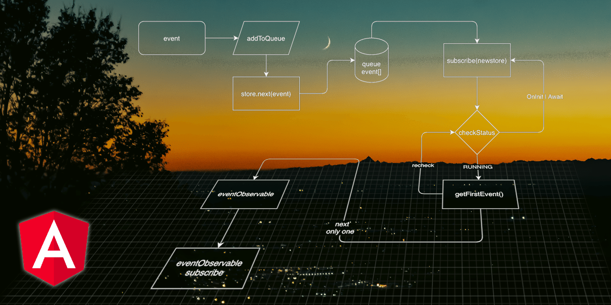
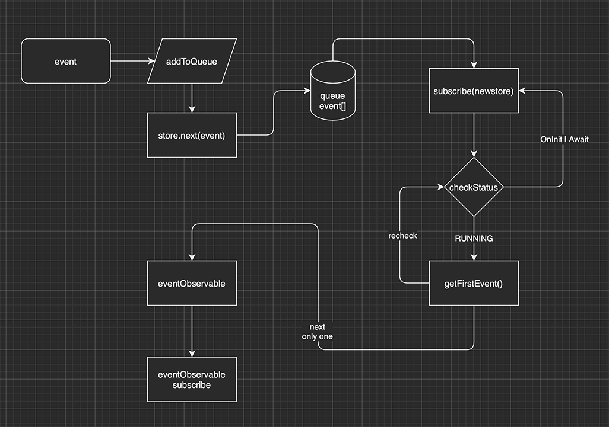

# TQueue 22.01

This project was generated with [Angular CLI](https://github.com/angular/angular-cli) version 13.1.2.

# Description

Simple queue class **TQueue** with basic States Store to manage external event without use too big and/or to complicated (for me ;) ) external libs.
All is with default ``rxjs``

``<app-t-queue>`` is a complete angular app, with routing page, to test, debug and sym how work
but to use in others apps we need only two classes:

- TStore<T>
- LiFoQueue<T> and/or FiFoQueue<T> thats extends base TQueue<T>

It's still work in progress... I hope will be a good starting point for some good develop idea...

# Basic flow

See ``./src/@docs/classes-graph.drawio`` file

- from somewhere there is a incoming  *type* **\<T\>** event
- the event is queued

    - the queue is ordered and managed by states

        - if queue is running dispatch event
        - if queue is stopped all next events are queued

    - when the queue from stopped->running all queued event are dispatched

We can wait async external data, like http, and meanwhile data are queued to evaluate in future.

--- 
###### **note:** sorry if you find some comment in italian and/or my english is not clear  ;) :)
---